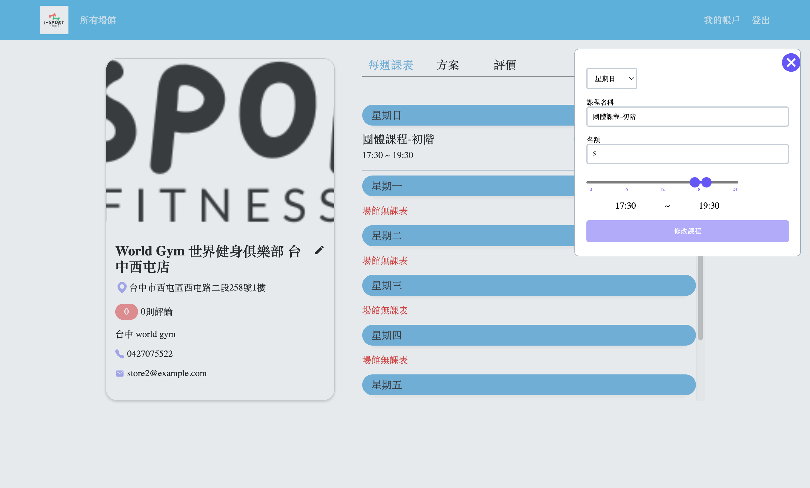

# 愛運動

[English README](#i-sport)

## 內文索引

- [概述](#概述)
  - [使用者故事](#使用者故事)
    - [用戶功能](#用戶功能)
    - [商家功能](#商家功能)
  - [螢幕截圖](#螢幕截圖)
  - [作品連結](#作品連結)
    - [測試帳號](#測試帳號)
- [過程](#過程)
  - [所用工具](#所用工具)
  - [學習到的是...](#學習到的是...)
  - [可以優化的地方](#可以優化的地方)
- [作者](#作者)
- [感謝](#感謝)

## 概述

I-sport 是一個整合運動場館課程預約平台，產品訴求是協助運動場館販賣課程並協助使用者更便利的預約及購買運動課程，使用者身份分為商家與用戶，商家登入後可以在平台上公告旗下場館課程資訊供用戶預約以及販賣課程方案，用戶登入後可查看商家資訊、預約場館課程、購買場館方案、查看場館評論或留下評論。

### 使用者故事

#### 用戶功能:

- 可以用 email 註冊帳號
- 註冊後，可以新增自己的大頭照，並更改「匿名」暱稱
- 選取 "skip" 可以直接到首頁
- 可以利用原有帳號與密碼登入
- 用戶進入「我的帳戶」或點擊大頭照圖示，可以修改 Email、暱稱、密碼、大頭貼或上傳大頭照
- 用戶登入後在「找場館」可以看到所有場館，並收藏場館，點擊 Map 顯示 Google 小地圖，標示該場館位置
- 進入「我的場館」頁面可以看到目前收藏場館
- 進入「我的預約」頁面可查看目前所有已預約課程
- 在「我的預約」可以取消已預約之課程
- 用戶點擊場館後可進入該場館頁面，課程頁籤將顯示該場館七天內之課程
- 在課程頁面，點選「預約」後，進入到預約頁面
- 選擇已購買該場館的課程方案後即可完成預約，並且扣除方案的計數
- 在場館頁「方案」頁籤將顯示該場館可購買的方案
- 點擊購買，在確認購買的小視窗確認後，將進入藍新金流付款頁
- 輸入卡號完成付款後按下返回商店按鍵即可返回 i-sport 頁面（建議用測試卡號測試）
- 場館頁「評價」頁籤將顯示該場館所有評價，用戶也可以留下評價

#### 商家功能:

- 可以用 email 註冊帳號後登入
- 商家進入「我的帳戶」頁，可以修改 Email、名稱、密碼
- 商家登入後在「所有場館」頁可以看到所有旗下場館，並可以建立、編輯場館
- 點擊場館後可進入該場館頁面，在該頁可以看到：「每週課表」、「方案」、「評價」頁籤
- 「每週課表」頁籤將列出星期日至星期六之課表，系統將據此自動生成未來七天之課程供用戶預約，商家也可以新增、編輯、刪除課程
- 「方案」頁籤將顯示該場館可購買的方案，商家可以新增、編輯、刪除方案
- 「評價」頁籤將顯示場館所有用戶留下的評價

### 螢幕截圖 ScreenShot

  <section>
    <h4>使用者畫面</h4>
    

      
      
      
      
      
      
      
      
      
      
      
      
    

    <h5 class="tx-underline">user1@example.com</h5>
    

      
      
      
    

  </section>

  <section>
    <h4>商家畫面</h4>
    

      
      
      
      
      
      
      
      
      
      
      
      
      
      
      
      
      
      
      
    

  </section>

### 作品連結

- [前端 Repo](https://github.com/Beginneraboutlife116/isport)
- [網站網址](https://isport-omega.vercel.app/login)
- [後端 Repo](https://github.com/popojk/i-sport)

#### 測試帳號

使用者帳號：

1. user1@example.com
2. user2@example.com
3. user3@example.com
4. user4@example.com
5. user5@example.com

使用者密碼：12345678

商家帳號：

1. tmma@tmma.com
2. hrc@hrc.com
3. goodtime@goodtime.com

商家密碼：12345678

## 過程

### 所用工具

- SCSS module
- [React](https://reactjs.org/) - JS library
- [React Router](https://nextjs.org/) - Routing library
- [React Hook Form]() - Form library
- [Material UI]() - UI library
- [Radix UI]() - UI library
- [Google Map React]() - Map library
- [Axios]() - API library
- [React icon]() - Icon library
- TypeScript
- Prettier
- ESLint

### 學習到的是...

- 使用 SCSS module，包含某個類別選擇器變成全域類別
- 使用 React Hook Form 做到表單驗證
- 使用 React Router 做到路由，並依其路由切換
- 使用 MUI 做到評價的星星功能
- 使用 Radix UI 做到商家新增課程時的 double thumb slider
- 使用 Google Map React 做到渲染地圖
- 使用 Axios 做到更簡便的 API 呼叫
- 使用 TypeScript 做到型別檢查、除錯等
- 使用 Prettier、ESLint 做到格式化，以及協作的格式統一

### 可以優化的地方

- 完成 google 帳號的登入
- 商品購買完成後，可以導回到自己設計的商品交易結果頁面
- RWD

## 作者

### 前端

#### Oliver Liao

- [Website](https://portfolio-website-ollieeryo.vercel.app/)
- [Github](https://github.com/Ollieeryo)
- [Linkedin](https://www.linkedin.com/in/oliver-nien-ching-liao/)
- [Medium](https://medium.com/@ollieeryo)

#### Wei Kai Lin

- [Github](https://github.com/Beginneraboutlife116)
- [Linkedin](https://www.linkedin.com/in/%E5%81%89%E5%87%B1-%E6%9E%97-668aaa204/)
- [Medium](https://medium.com/@weikai0116)

### 後端

#### 吳忠全

- [Github](https://github.com/popojk)

## 感謝

感謝本次專案的召集人 [忠全](https://github.com/popojk) ，不僅完成 API 規劃，並且也做出線稿圖，加速專案的進行。

前端也感謝 [Liao Oliver](https://github.com/Ollieeryo)、[Wei Kai Lin](https://github.com/Beginneraboutlife116) 的協作、產出

---

# I-sport

## Table of contents

- [Overview](#overview)
  - [User Story](#user-story)
    - [User](#user)
    - [Store](#store)
  - [Screenshot](#螢幕截圖-screenshot)
  - [Links](#links)
- [My process](#my-process)
  - [Built with](#built-with)
  - [What I learned](#what-i-learned)
  - [Continued development](#continued-development)
- [Author](#author)
- [Acknowledgments](#acknowledgments)

## Overview

I-sport is an integrated sports facility and course reservation platform.
The products's main goal is to assist sports facilities owner in selling courses and to facilitate users in conveniently reserving and purchasing courses.

Users are categorized as either merchants or customers.
After logging in, merchants can announce information about their sports facilities and courses for customers to reserve and purchase course plans.
On the other hand, customers can log in to view merchant information, reserve sports facility courses, purchase facility plans, read venue reviews, or leave their own reviews.

### User Story

#### User

- Users can register an account using their email.
- After registration, users can add their own profile picture and change their "anonymous" nickname.
- Users can select "skip" to go directly to the homepage.
- Users can log in using their existing account and password.
- In the "My Account" section or by clicking on the profile picture icon, users can modify their email, nickname, password, and profile picture or upload a new one.
- Once logged in, users can view all sports facilities under the "Find Venues" section, where they can also bookmark venues. Clicking on the Map will display the location of the selected venue using Google Maps.
- Under the "My Venues" page, users can see their currently bookmarked venues.
- In the "My Bookings" page, users can view all their scheduled course reservations.
- Users can cancel a reserved course on the "My Bookings" page.
- By clicking on a venue, users can access the venue's page, where the "Courses" tab will display courses available within the next seven days.
- On the course page, clicking "Book" will take the user to the reservation page.
- After choosing a purchased course plan for the selected venue, users can complete the reservation and deduct the course count from the plan.
- Under the venue page's "Plans" tab, users can see available plans for purchase.
- Clicking "Buy" will open a confirmation window, and upon confirming, users will proceed to the BluePay payment page.
- After entering the card information and completing the payment, clicking "Return to Store" will bring users back to the i-sport page (recommended to use test card numbers for testing).
- Under the venue page's "Reviews" tab, users can see all reviews for that venue and can also leave their own reviews.

#### Store

- Users can register an account using their email and log in afterward.
- Merchants can access the "My Account" page to modify their email, name, and password.
- After logging in, merchants can view all their affiliated venues under the "All Venues" page and have the option to create and edit venues.
- By clicking on a venue, merchants can access the venue's page, where they can view the "Weekly Schedule," "Plans," and "Reviews" tabs.
- Under the "Weekly Schedule" tab, the system will list the schedule from Sunday to Saturday, automatically generating courses for the next seven days for users to reserve. Merchants can also add, edit, or delete courses.
- The "Plans" tab will display packages available for purchase at the venue, and merchants can add, edit, or delete packages.
- Under the "Reviews" tab, all user reviews for the venue will be displayed.

### [Screenshot](#螢幕截圖-screenshot)

### Links

- [Frontend Repo](https://github.com/Beginneraboutlife116/isport)
- [Live Site URL](https://isport-omega.vercel.app/login)
- [Backend Repo](https://github.com/popojk/i-sport)

#### Test Account

User Accounts:

1. user1@example.com
2. user2@example.com
3. user3@example.com
4. user4@example.com
5. user5@example.com

User Password：12345678

Store Accounts：

1. tmma@tmma.com
2. hrc@hrc.com
3. goodtime@goodtime.com

Store Password：12345678

## My process

### Built with

- SCSS module
- [React](https://reactjs.org/) - JS library
- [React Router](https://nextjs.org/) - Routing library
- [React Hook Form]() - Form library
- [Material UI]() - UI library
- [Radix UI]() - UI library
- [Google Map React]() - Map library
- [Axios]() - API library
- [React icon]() - Icon library
- TypeScript
- Prettier
- ESLint

### What I learned

- Utilized SCSS modules, including converting a specific class selector to a global class.
- Implemented form validation using React Hook Form.
- Utilized React Router for handling routing and page navigation.
- Implemented a star rating feature for reviews using MUI (Material-UI) components.
- Incorporated Radix UI to achieve a double-thumb slider for adding courses in the merchant's interface.
- Utilized Google Map React to render maps and display locations on the platform.
- Simplified API calls by using Axios.
- Implemented TypeScript for type checking, debugging, and enhanced code reliability.
- Used Prettier and ESLint for code formatting and ensuring consistent formatting standards across collaboration.

### Continued development

- Implemented Google account login functionality.
- After completing a product purchase, users are redirected to a custom-designed transaction result page.
- Ensured a responsive web design (RWD) to provide an optimal user experience across various devices and screen sizes.

## Author

### Frontend

#### Oliver Liao

- [Website](https://portfolio-website-ollieeryo.vercel.app/)
- [Github](https://github.com/Ollieeryo)
- [Linkedin](https://www.linkedin.com/in/oliver-nien-ching-liao/)
- [Medium](https://medium.com/@ollieeryo)

#### Wei Kai Lin

- [Github](https://github.com/Beginneraboutlife116)
- [Linkedin](https://www.linkedin.com/in/%E5%81%89%E5%87%B1-%E6%9E%97-668aaa204/)
- [Medium](https://medium.com/@weikai0116)

### Backend

#### 吳忠全

- [Github](https://github.com/popojk)

## Acknowledgments

Special thanks to the project organizer [忠全](https://github.com/popojk) for not only planning the API but also creating the wireframes, which greatly accelerated the progress of the project.

Also thanks to the frontend collaborators [Liao Oliver](https://github.com/Ollieeryo) and [Wei Kai Lin](https://github.com/Beginneraboutlife116) for their collaboration and contributions.
