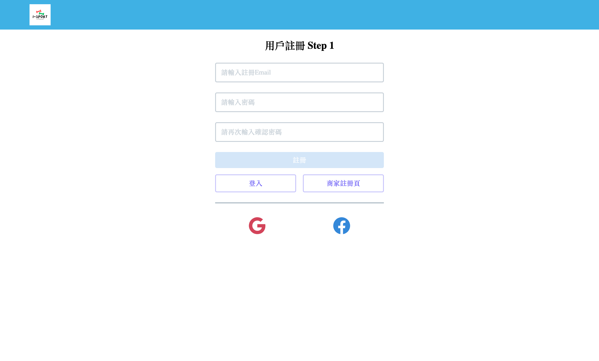

# 愛運動

[English README](#i-sport)

## 內文索引

- [概述](#概述)
  - [使用者故事](#使用者故事)
    - [用戶功能](#用戶功能)
    - [商家功能](#商家功能)
  - [螢幕截圖](#螢幕截圖)
  - [作品連結](#作品連結)
- [過程](#過程)
  - [所用工具](#所用工具)
  - [學習到的是...](#學習到的是...)
  - [可以優化的地方](#可以優化的地方)
  - [參考資源](#參考資源)
- [作者](#作者)
- [感謝](#感謝)

## 概述

i-sport 是一個整合運動場館課程預約平台，產品訴求是協助運動場館販賣課程並協助使用者更便利的預約及購買運動課程，使用者身份分為商家與用戶，商家登入後可以在平台上公告旗下場館課程資訊供用戶預約以及販賣課程方案，用戶登入後可查看商家資訊、預約場館課程、購買場館方案、查看場館評論或留下評論。

### 使用者故事

#### 用戶功能:

- 可以用 email 註冊帳號
- 註冊後，可以新增自己的大頭照，並更改「匿名」暱稱
- 選取 "skip" 可以直接到首頁
- 可以利用原有帳號與密碼登入
- 用戶進入「我的帳戶」或點擊大頭照圖示，可以修改 Email、暱稱、密碼、大頭貼或上傳大頭照
- 用戶登入後在「找場館」可以看到所有場館，並收藏場館，點擊 Map 顯示 Google 小地圖，標示該場館位置
- 進入「我的場館」頁面可以看到目前收藏場館
- 進入「我的預約」頁面可查看目前所有已預約課程
- 在「我的預約」可以取消已預約之課程
- 用戶點擊場館後可進入該場館頁面，課程頁籤將顯示該場館七天內之課程
- 在課程頁面，點選「預約」後，進入到預約頁面
- 選擇已購買該場館的課程方案後即可完成預約，並且扣除方案的計數
- 在場館頁「方案」頁籤將顯示該場館可購買的方案
- 點擊購買，在確認購買的小視窗確認後，將進入藍新金流付款頁
- 輸入卡號完成付款後按下返回商店按鍵即可返回 i-sport 頁面（建議用測試卡號測試）
- 場館頁「評價」頁籤將顯示該場館所有評價，用戶也可以留下評價

#### 商家功能:

- 可以用 email 註冊帳號後登入
- 商家進入「我的帳戶」頁，可以修改 Email、名稱、密碼
- 商家登入後在「所有場館」頁可以看到所有旗下場館，並可以建立、編輯場館
- 點擊場館後可進入該場館頁面，在該頁可以看到：「每週課表」、「方案」、「評價」頁籤
- 「每週課表」頁籤將列出星期日至星期六之課表，系統將據此自動生成未來七天之課程供用戶預約，商家也可以新增、編輯、刪除課程
- 「方案」頁籤將顯示該場館可購買的方案，商家可以新增、編輯、刪除方案
- 「評價」頁籤將顯示場館所有用戶留下的評價

### 螢幕截圖

<div>
  <section>
    <h4>使用者畫面</h4>
    <div class="screenshots">
      
      
      
      
      
      
      
      
      
      
      
      
    </div>
    <h5 class="tx-underline">user1@example.com</h5>
    <div class="screenshots">
      
      
      
    </div>
  </section>

  <section>
    <h4>商家畫面</h4>
    <div class="screenshots">
      
      
      
    </div>
  </section>

  <style>
    img {
      max-width: 100%;
      height: auto;
    }

    .screenshots {
      display: grid;
      grid-template-columns: 1fr 1fr;
      gap: 1rem;
    }

    .tx-underline {
      text-decoration: underline;
    }
  </style>
</div>

### 作品連結

- [前端 Repo](https://github.com/Beginneraboutlife116/isport)
- [網站網址](https://isport-omega.vercel.app/login)
- [後端 Repo](https://github.com/popojk/i-sport)

## 過程

### 所用工具

- SCSS module
- [React](https://reactjs.org/) - JS library
- [React Router](https://nextjs.org/) - Routing library
- [React Hook Form]() - Form library
- [Material UI]() - UI library
- [Radix UI]() - UI library
- [Google Map React]() - Map library
- [Axios]() - API library
- [React icon]() - Icon library
- TypeScript
- Prettier
- ESLint

### 學習到的是...

- 使用 SCSS module，包含某個類別選擇器變成全域類別
- 使用 React Hook Form 做到表單驗證
- 使用 React Router 做到路由，並依其路由切換
- 使用 MUI 做到評價的星星功能
- 使用 Radix UI 做到商家新增課程時的 double thumb slider
- 使用 Google Map React 做到渲染地圖
- 使用 Axios 做到更簡便的 API 呼叫
- 使用 TypeScript 做到型別檢查、除錯等
- 使用 Prettier、ESLint 做到格式化，以及協作的格式統一

### 可以優化的地方

- 完成 google 帳號的登入
- 商品購買完成後，可以導回到自己設計的商品交易結果頁面
- RWD

## 作者

### 前端

#### Oliver Liao

- [Website](https://portfolio-website-ollieeryo.vercel.app/)
- [Github](https://github.com/Ollieeryo)
- [Linkedin](https://www.linkedin.com/in/oliver-nien-ching-liao/)
- [Medium](https://medium.com/@ollieeryo)

#### Wei Kai Lin

- [Github](https://github.com/Beginneraboutlife116)
- [Linkedin](https://www.linkedin.com/in/%E5%81%89%E5%87%B1-%E6%9E%97-668aaa204/)
- [Medium](https://medium.com/@weikai0116)

### 後端

#### 吳忠全

- [Github](https://github.com/popojk)

## 感謝

感謝本次專案的召集人 [忠全](https://github.com/popojk) ，不僅完成 API 規劃，並且也做出線稿圖，加速專案的進行。

前端也感謝 [Liao Oliver](https://github.com/Ollieeryo)、[Wei Kai Lin](https://github.com/Beginneraboutlife116) 的協作、產出

---

# I-sport

## Table of contents

- [Overview](#overview)
  - [The challenge](#the-challenge)
  - [Screenshot](#screenshot)
  - [Links](#links)
- [My process](#my-process)
  - [Built with](#built-with)
  - [What I learned](#what-i-learned)
  - [Continued development](#continued-development)
  - [Useful resources](#useful-resources)
- [Author](#author)
- [Acknowledgments](#acknowledgments)

## Overview

### The challenge

Users should be able to:

- (Like writing user story)

### Screenshot


Add a screenshot of your solution. The easiest way to do this is to use Firefox to view your project, right-click the page and select "Take a Screenshot". You can choose either a full-height screenshot or a cropped one based on how long the page is. If it's very long, it might be best to crop it.

Alternatively, you can use a tool like [FireShot](https://getfireshot.com/) to take the screenshot. FireShot has a free option, so you don't need to purchase it.

Then crop/optimize/edit your image however you like, add it to your project, and update the file path in the image above.

**Note: Delete this note and the paragraphs above when you add your screenshot. If you prefer not to add a screenshot, feel free to remove this entire section.**

### Links

- Solution URL: [Add solution URL here](https://your-solution-url.com)
- Live Site URL: [Add live site URL here](https://your-live-site-url.com)

## My process

### Built with

- Semantic HTML5 markup
- CSS custom properties
- Flexbox
- CSS Grid
- Mobile-first workflow
- [React](https://reactjs.org/) - JS library
- [Next.js](https://nextjs.org/) - React framework
- [Styled Components](https://styled-components.com/) - For styles

**Note: These are just examples. Delete this note and replace the list above with your own choices**

### What I learned

Use this section to recap over some of your major learnings while working through this project. Writing these out and providing code samples of areas you want to highlight is a great way to reinforce your own knowledge.

To see how you can add code snippets, see below:

```html
<h1>Some HTML code I'm proud of</h1>
```

```css
.proud-of-this-css {
	color: papayawhip;
}
```

```js
const proudOfThisFunc = () => {
	console.log('🎉');
};
```

If you want more help with writing markdown, we'd recommend checking out [The Markdown Guide](https://www.markdownguide.org/) to learn more.

**Note: Delete this note and the content within this section and replace with your own learnings.**

### Continued development

Use this section to outline areas that you want to continue focusing on in future projects. These could be concepts you're still not completely comfortable with or techniques you found useful that you want to refine and perfect.

**Note: Delete this note and the content within this section and replace with your own plans for continued development.**

### Useful resources

- [Example resource 1](https://www.example.com) - This helped me for XYZ reason. I really liked this pattern and will use it going forward.
- [Example resource 2](https://www.example.com) - This is an amazing article which helped me finally understand XYZ. I'd recommend it to anyone still learning this concept.

**Note: Delete this note and replace the list above with resources that helped you during the challenge. These could come in handy for anyone viewing your solution or for yourself when you look back on this project in the future.**

## Author

- Website - [Add your name here](https://www.your-site.com)
- Frontend Mentor - [@yourusername](https://www.frontendmentor.io/profile/yourusername)
- Twitter - [@yourusername](https://www.twitter.com/yourusername)

**Note: Delete this note and add/remove/edit lines above based on what links you'd like to share.**

## Acknowledgments

This is where you can give a hat tip to anyone who helped you out on this project. Perhaps you worked in a team or got some inspiration from someone else's solution. This is the perfect place to give them some credit.
